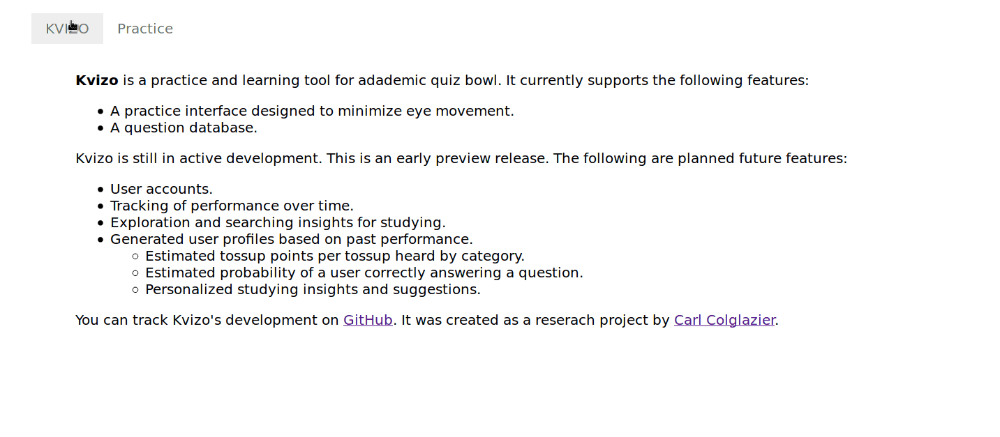

# KVIZO



Kvizo is a practice and learning tool for adademic quiz bowl. It
currently supports the following features:

+ A practice interface designed to minimize eye movement.
+ A question database.

Kvizo is still in active development. This is an early preview
release. The following are planned future features:

+ User accounts.
+ Tracking of performance over time.
+ Exploration and searching insights for studying.
+ Generated user profiles based on past performance.
  - Estimated tossup points per tossup heard by category.
  - Estimated probability of a user correctly answering a question.
  - Personalized studying insights and suggestions.
  
### Installation

This section describes how to set up Kvizo on your own system. It is a
webapp meant to be accessed through a web browser. The following
documentation describes how to deploy the program using NGINX,
Gunicorn, and PostgreSQL.

1. Clone the repository on the server.
   
   ```sh
   git clone git@github.com:CarlColglazier/kvizo.git
   cd kvizo
   ```
   
2. (Optional) Use a virtual environment for the Python backend .

    ```sh
    virtualenv .env

    ```
3. Install dependencies.

    ```sh
    pip install -r backend/requirements.txt
    cd frontend
    npm install
    cd ..
    ```

4. Set up the database. This is how I did it using PostgreSQL.

    ```sh
    sudo su - postgres
    psql
    #    CREATE DATABASE <projectname>;
    #    CREATE USER <user> WITH PASSWORD '<password>';
    #    ALTER ROLE <user> SET client_encoding TO 'utf8';
    #    ALTER ROLE <user> SET default_transaction_isolation TO 'read committed';
    #    ALTER ROLE <user> SET timezone TO 'UTC';
    #    GRANT ALL PRIVILEGES ON DATABASE <projectname> TO <user>;
    \q
    exit
    ```
    
5. Add your secret information.

   ```sh
   cp backend/kvizo/secret-template.py backend/kvizo/secret.py
   ```
   
   Edit `secret.py` to add the required information.

6. Set up the database.

    ```sh
    cd backend
    python manage.py migrate
    ```

7. Collect static files.

    ```sh
    python manage.py collectstatic
    cd ../frontend
    npm run-script build
    cd ..
    ```

8. Populate the database.

   ```sh
   python manage.py import_tossups <file>
   ```
   
9. Create an admin user.

    ```sh
    python manage.py createsuperuser
    ```

10. Set up Gunicorn and NGINX. How this is done will depend on your server settings.
